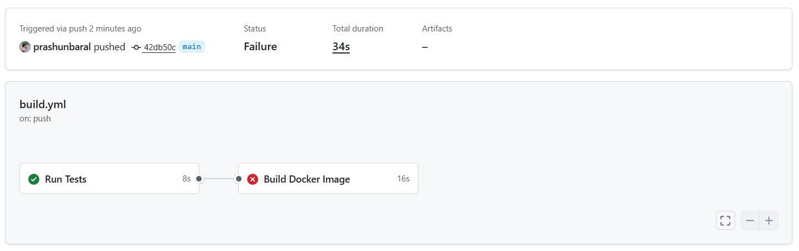

# Debugging Detective Report

## Part A: How the Working Pipeline Works

### Overview

My CI/CD pipeline from Assignment 1 consists of two jobs that run sequentially to ensure code quality before building.

### Pipeline Structure

**Trigger:**

- The workflow triggers on every `push` to the `main` branch
- This ensures that all changes are automatically validated

**Job 1: test-job**

- **Purpose:** Validates that the application works correctly
- **Steps:**
  1. Checks out the code from the repository
  2. Sets up Node.js environment (version 18)
  3. Installs project dependencies using `npm install`
  4. Runs the test suite using `npm test`
- **Critical Role:** Acts as a quality gate - if tests fail, the entire pipeline stops

**Job 2: build-job**

- **Purpose:** Builds the Docker image to verify the Dockerfile is valid
- **Dependency:** Uses `needs: test-job` keyword
- **Steps:**
  1. Checks out the code
  2. Sets up Docker Buildx for building images
  3. Builds the Docker image using the Dockerfile
  4. Verifies the image was created successfully

### The `needs:` Keyword Explained

The `needs: test-job` in the build-job configuration creates a dependency chain:

- **build-job** will ONLY run if **test-job** completes successfully
- If tests fail, the build job is skipped entirely
- This prevents building broken code into Docker images
- It's a core CI principle: "Don't build what you can't test"

### Why This Matters

This two-stage approach ensures:

1. **Quality Assurance:** Code is tested before being packaged
2. **Fast Feedback:** Developers know immediately if their changes break tests
3. **Resource Efficiency:** We don't waste time building images from broken code
4. **Reliable Artifacts:** Every Docker image represents tested, working code

---

## Part B: The "Break and Fix" Challenge

### Step 1: Breaking the Pipeline

**What I Changed:**
I intentionally broke the Dockerfile by modifying the base image to a non-existent tag:

```dockerfile
FROM node:18-this-is-a-fake-tag
```

### Error Screenshot



### Error Analysis

**Error Message:**
ERROR: failed to build: failed to solve: node:18-this-is-a-fake-tag: failed to resolve source metadata for docker.io/library/node:18-this-is-a-fake-tag: docker.io/librarynode:18-this-is-a-fake-tag: not found
Error: Process completed with exit code 1.

**What This Means:**

- Docker attempted to pull the base image `node:18-this-is-a-fake-tag` from Docker Hub (docker.io/library)
- The build process failed because it couldn't resolve the source metadata for this image
- This specific image tag doesn't exist in the Docker registry
- Docker cannot proceed with the build because it can't find the foundation image
- The error occurs at the very first step (FROM instruction) of the Dockerfile
- Exit code 1 indicates the build process terminated with an error

**Root Cause:**
The tag `this-is-a-fake-tag` is not a valid release tag for the Node.js official image on Docker Hub. Valid tags include `18-alpine`, `18-slim`, `18`, `18.20.5`, etc. Docker searched for this non-existent tag and failed to find it in the registry.

### The Fix

**What I Changed:**
Reverted the Dockerfile to use a valid base image:

```dockerfile
FROM node:18-alpine
```
